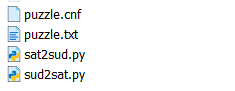
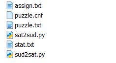
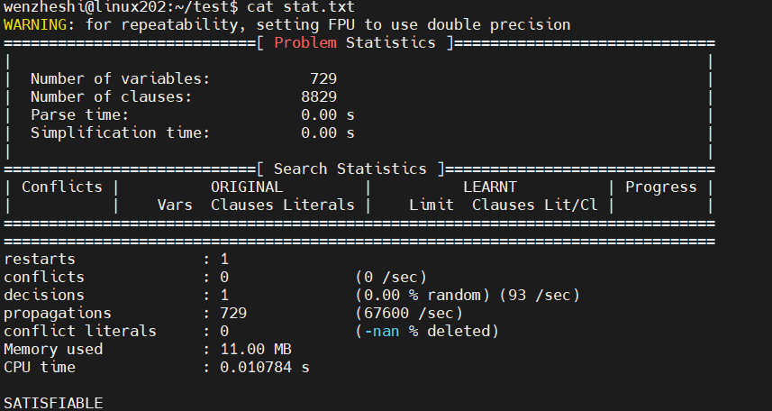
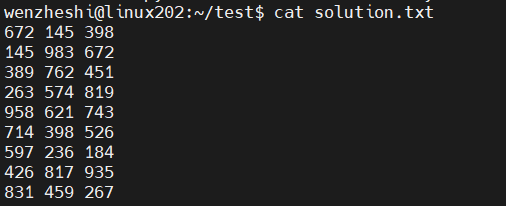

# CSC 322 Project 1
by

Halle Koyanagi V00913278,
Vyom Shah V00951024

## Basic Task Execution

Execute the following code in a Linux environment
### Read a single Sudoku and convert it to SAT format
~~~
python sud2sat.py < puzzle.txt > puzzle.cnf
cat puzzle.cnf
~~~

### Enter the Sudoku in SAT format into the minisat to solve
~~~
minisat puzzle.cnf assign.txt > stat.txt
~~~

### The final output is the result of the solution
~~~
python sat2sud.py < assign.txt > solution.txt
cat solution.txt
~~~

