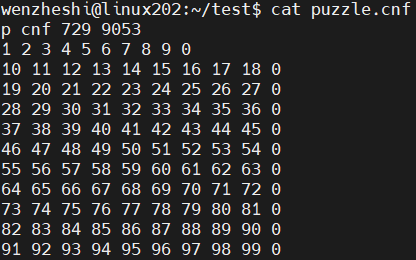
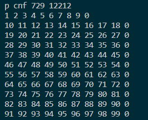
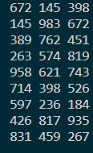
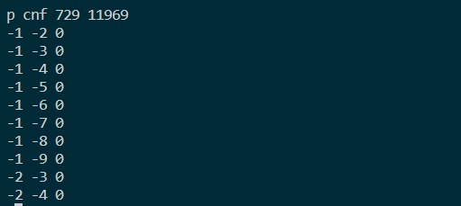
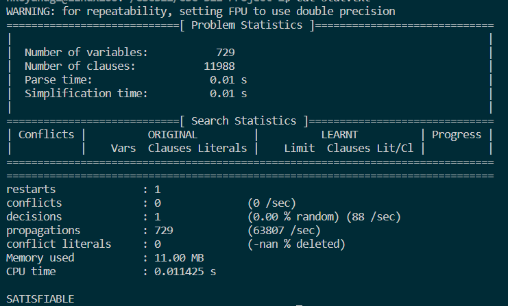

# CSC 322 Project 1
By 
Halle Koyanagi V00913278,
Vyom Shah V00951024,
Wenzhe Shi V00968344

## Shell Commands

For all tasks, shell scripts were made to facilitate execution. Execution is detailed below but can be summarized by the following commands

### Basic Task
Conversion from unsolved suduko puzzle into cnf formulas
~~~
bash sud2sat.sh < [unsolved puzzle text file] > [cnf formulas text file]
~~~
Conversion from the output of a minisat command into solved suduko puzzle
~~~
bash sat2sud.sh < [minisat output text file] > [solved puzzle text file]
~~~
### Extended Task 2
Conversion from unsolved suduko puzzle into cnf formulas
~~~
bash sud2sat2.sh < [unsolved puzzle text file] > [cnf formulas text file]
~~~
Conversion from the output of a minisat command into solved suduko puzzle
~~~
bash sat2sud2.sh < [minisat output text file] > [solved puzzle text file]
~~~
### Extended Task 3
Conversion from unsolved suduko puzzle into cnf formulas
~~~
bash sud2sat3.sh < [unsolved puzzle text file] > [cnf formulas text file]
~~~
Conversion from the output of a minisat command into solved suduko puzzle
~~~
bash sat2sud3.sh < [minisat output text file] > [solved puzzle text file]
~~~
## Task Executions
For simplicity, the following filenames are used as an example:

* puzzle.txt - unsolved sudoku puzzle
* puzzle.cnf - cnf formulas from sudoku puzzle
* assign.txt - minisat solution output
* stat.txt - minisat solution stats
* solution.txt - solved and formatted sudoku puzzle

note that extended tasks are executed in the same way as the basic task but with differing filenames
### Basic Task

Execute the following code in a Linux environment
#### Read a single Sudoku and convert it to SAT format
~~~
python sud2sat.py < puzzle.txt > puzzle.cnf
cat puzzle.cnf
~~~

#### Enter the Sudoku in SAT format into the minisat to solve
~~~
minisat puzzle.cnf assign.txt > stat.txt
~~~

#### The final output is the result of the solution
~~~
python sat2sud.py < assign.txt > solution.txt
cat solution.txt
~~~

### Task 2 Execution

Execute the following code in a Linux environment
### Read a single Sudoku and convert it to SAT format
~~~
python sud2sat2.py < puzzle.txt > puzzle.cnf
cat puzzle.cnf
~~~

### Enter the Sudoku in SAT format into the minisat to solve
~~~
minisat puzzle.cnf assign.txt > stat.txt
cat stat.txt
~~~

### The final output is the result of the solution
~~~
python sat2sud.py < assign.txt > solution.txt
cat solution.txt
~~~

### Task 2 Execution

Execute the following code in a Linux environment
### Read a single Sudoku and convert it to SAT format
~~~
python sud2sat3.py < puzzle.txt > puzzle.cnf
cat puzzle.cnf
~~~

### Enter the Sudoku in SAT format into the minisat to solve
~~~
minisat puzzle.cnf assign.txt > stat.txt
cat stat.txt
~~~

### The final output is the result of the solution
~~~
python sat2sud.py < assign.txt > solution.txt
cat solution.txt
~~~

## File Hierarchy