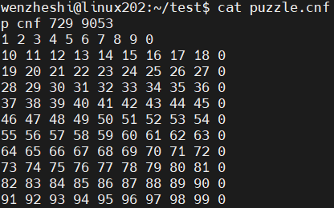
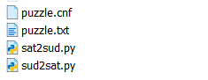
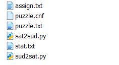
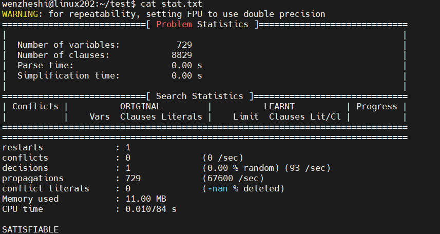
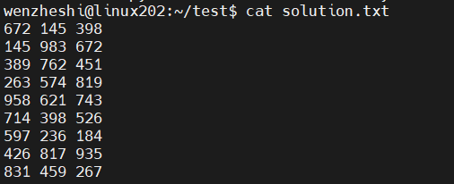
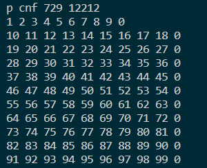
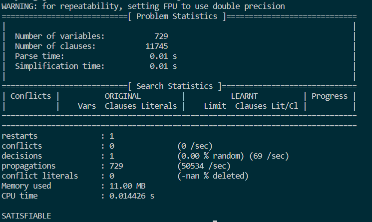
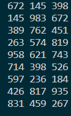
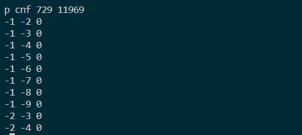
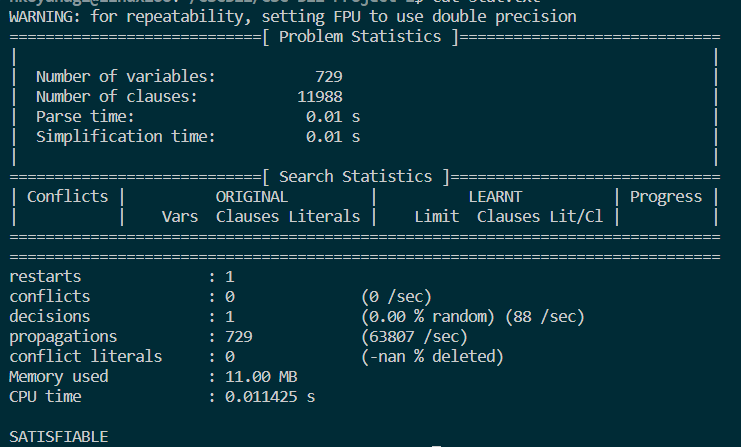

# CSC 322 Project 1
By 
Halle Koyanagi V00913278,
Vyom Shah V00951024,
Wenzhe Shi V00968344

## Shell Commands

For all tasks, shell scripts were made to facilitate execution. Execution is detailed below but can be summarized by the following commands

Note that the sat2sud.sh remains the same for all tasks as the conversion from solved minisat output to sudoku is not affected by different encodings.

### Basic Task
Conversion from unsolved sudoku puzzle into cnf formulas
~~~
bash sud2sat.sh < [unsolved puzzle text file] > [cnf formulas text file]
~~~
Conversion from the output of a minisat command into solved sudoku puzzle
~~~
bash sat2sud.sh < [minisat output text file] > [solved puzzle text file]
~~~
### Extended Task 2
Conversion from unsolved sudoku puzzle into cnf formulas
~~~
bash sud2sat2.sh < [unsolved puzzle text file] > [cnf formulas text file]
~~~
Conversion from the output of a minisat command into solved sudoku puzzle
~~~
bash sat2sud.sh < [minisat output text file] > [solved puzzle text file]
~~~
### Extended Task 3
Conversion from unsolved sudoku puzzle into cnf formulas
~~~
bash sud2sat3.sh < [unsolved puzzle text file] > [cnf formulas text file]
~~~
Conversion from the output of a minisat command into solved sudoku puzzle
~~~
bash sat2sud.sh < [minisat output text file] > [solved puzzle text file]
~~~
### Cleaning the Directory
The following command cleans the directory of any files created in the tasks listed above. Do not run this unless finished analyzing results and stats

~~~
bash clean.sh
~~~
## Task Executions
For simplicity, the following filenames are used as an example:

* puzzle.txt - unsolved sudoku puzzle
* puzzle.cnf - cnf formulas from sudoku puzzle
* assign.txt - minisat solution output
* stat.txt - minisat solution stats
* solution.txt - solved and formatted sudoku puzzle

note that extended tasks are executed in the same way as the basic task but with differing filenames
### Basic Task

Execute the following code in a Linux environment
#### Read a single Sudoku and convert it to SAT format
~~~
python sud2sat.py < puzzle.txt > puzzle.cnf
cat puzzle.cnf
~~~

#### Enter the Sudoku in SAT format into the minisat to solve
~~~
minisat puzzle.cnf assign.txt > stat.txt
~~~

#### The final output is the result of the solution
~~~
python sat2sud.py < assign.txt > solution.txt
cat solution.txt
~~~

### Task 2 Execution

Execute the following code in a Linux environment
### Read a single Sudoku and convert it to SAT format
~~~
python sud2sat2.py < puzzle.txt > puzzle.cnf
cat puzzle.cnf
~~~

### Enter the Sudoku in SAT format into the minisat to solve
~~~
minisat puzzle.cnf assign.txt > stat.txt
cat stat.txt
~~~

### The final output is the result of the solution
~~~
python sat2sud.py < assign.txt > solution.txt
cat solution.txt
~~~

### Task 2 Execution

Execute the following code in a Linux environment
### Read a single Sudoku and convert it to SAT format
~~~
python sud2sat3.py < puzzle.txt > puzzle.cnf
cat puzzle.cnf
~~~

### Enter the Sudoku in SAT format into the minisat to solve
~~~
minisat puzzle.cnf assign.txt > stat.txt
cat stat.txt
~~~

### The final output is the result of the solution
~~~
python sat2sud.py < assign.txt > solution.txt
cat solution.txt
~~~

## File Hierarchy

### sat2sud.py
Program that reads a unsolved sudoku puzzle from STDIN and creates minimal encoding CNF formulas in DIMACs form and prints to STDOUT

### sat2sud2.py
Program that reads a unsolved sudoku puzzle from STDIN and creates efficient encoding CNF formulas in DIMACs form and prints to STDOUT

### sat2sud3.py
Program that reads a unsolved sudoku puzzle from STDIN and creates extended encoding CNF formulas in DIMACs form and prints to STDOUT

### sat2sud.sh
Script shell that runs sat2sud.py

### sat2sud2.sh
Script shell that runs sat2sud2.py

### sat2sud3.sh
Script shell that runs sat2sud3.py

### sud2sat.py
Program that reads the solved output of a minisat command from STDIN and converts it to a formatted sudoku puzzle in STDOUT

### sud2sat.sh
Script shell that runs sud2sat.py
